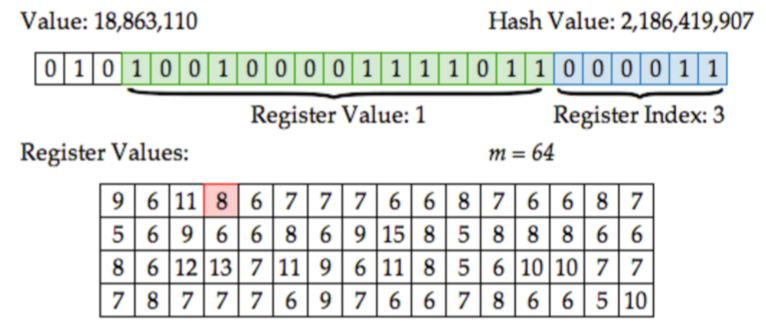

  <big><b>Monoids and Terascale EDA</b></big>  
   

  <code>chris@datascience.com</code>
   
   

# presenter notes
Statistical analysis and mining of huge multi-terabyte data sets is a common task nowadays, especially in the areas like App analytics and Internet advertising. Analysis of such large data sets often requires powerful distributed data stores and heavy data processing with techniques like MapReduce.

This approach often leads to heavyweight high-latency analytical processes and poor applicability to realtime use cases. On the other hand, when one is interested only in simple additive metrics like total page views or average price of conversion, it is obvious that raw data can be efficiently summarized, for example, on a daily basis or using simple in-stream counters.  Computation of more advanced metrics like a number of unique visitor or most frequent items is more challenging and requires a lot of resources if implemented straightforwardly.

This talk provides an overview of probabilistic data structures that allow one to estimate these and many other metrics and trade precision of the estimations for the memory consumption. These data structures can be used both as temporary data accumulators in query processing procedures and, perhaps more important, as a compact replacement of raw data in stream-based computing.

---

#Monoids

---

#Associativity

For all $ a, b, c \in M $ we have:
$$
$$
$$
(a + b) + c = a + (b + c)
$$

---

Associativity allows for `MapReduce` parallelism in computing.

$$
(a + b) + (c + d) + (e + f) + (g + h)
$$
$$
(a + b + c + d) + (e + f + g + h)
$$
$$
(a + b + c + d + e + f + g + h)
$$

.notes: Lack of associativity increases latency exponentially.

---

#Identity

There exists an element $0$ such that for all $a \in M$
$$
$$
$$
0 + a = a + 0 = a
$$

---

Identity allows for noops and null values in the data.
$$
$$
$$
0 + a + 0 + 0 + b + 0 + c + 0 + 0 = a + b + c
$$

---

#Basic Monoids

* addition, multiplication, concatenation, etc
* set union / intersection
* hashmaps
* Boolean AND / OR
* min / max

---

    !scala
    scala> val data2 =    Map(1 -> 1, 2 -> 1)
    data2: Map[Int,Int] = Map(1 -> 1, 2 -> 1)
    scala> val data1 =    Map(1 -> 3, 2 -> 5, 3 -> 7)
    data1: Map[Int,Int] = Map(1 -> 3, 2 -> 5, 3 -> 7)
    scala> data1 + data2
    error: type mismatch

---

    !scala
    scala> import com.twitter.algebird.Operators._
    scala> Map(1 -> 2, 2 -> 1) + Map(1 -> 3, 3 -> 5)
    res0: Map[Int,Int] = Map(1 -> 5, 3 -> 5, 2 -> 1)
    scala> Map(1 -> 2, 2 -> 1) * Map(1 -> 3, 3 -> 5)
    res1: Map[Int,Int] = Map(1 -> 6)

.notes: Note the effect of the multiplication

---

    !scala
    scala> Map(1 -> Set(2,3), 2 -> Set(1)) + Map(2 -> Set(1,2,3))
    res2: Map[Int,Set[Int]] = Map(1 -> Set(2, 3), 2 -> Set(1, 2, 3))

---

#What about a mean average?

    !scala
    avg(0, 1, 2, 3, 4) != avg(0 ,1, 2) + avg(3, 4)
    2 != 1 + 3.5

---

#Use a Product Monoid

    !scala
    (a.cnt, a.avg) + (b.cnt, b.avg) =
      ( a.cnt + b.cnt, (a.cnt*a.avg + b.cnt*b.avg)/(a.cnt + b.cnt))

---

    !scala
    scala> AveragedValue(3,(0+1+2)/3.0) + AveragedValue(2,(3+4)/2.0)
    res3: AveragedValue = AveragedValue(5,2.0)

---

#Product Monoids

* mean + higher moments (variance, skewness etc)
* harmonic mean
* median (Q-Digest)
* mode (Count-min sketch)
* probabilistic data structures (HyperLogLog, Bloom Filters etc)

.notes: Hashing vs Sampling

---

.fx: imageslide whiteheading

---

#Algebird

An Abstract Algebra library from Twitter for solving large "counting" problems

* Abstract algebraic types (e.g. semigroups, monoids etc)
* Monoid interfaces for standard Scala types
* Bloom Filter, HyperLogLog, Count-min Sketch, ARIMA, Q-Digests etc
* Aggregation of complex data structures with Spark can be expressed as a simple MapReduce: `rdd.map(toMonoid(_)).reduce(_+_)`

---

#Bloom Filter

**Problem**: Show new Tinder profiles without repeating profiles that have already been swiped on.

Tinder has over 50 million active monthly users averaging over 1.6 billion swipes per day.

Storing the swiped graph as a `Set[(User,Profile)]` or a `Map[User,Set[Profile]]` would be prohibitively expensive.

.notes: The Bloom Filter is probably the most famous and widely used probabilistic data structure. It is widely used as a preliminary probabilistic test that allows one to reduce a number of exact checks.

---

* Like an approximate `Set`
* `Bloom.contains(Profile) => Maybe | No`
* Precision < 1.0 (P(false positive) > 0)
* Recall = 1.0 (P(false negative = 0))

---

Under the hood: k hashes into an m-bit array.

.notes: We can tune Precision with m and k.

---

#Precision Tuning

After $n$ insertions, the probability that a given bit is not set to 1 by any of the $k$ hash functions is

$$
\left(1-\frac{1}{m}\right)^{kn}
$$

Therefore the probability of a false positive is:

$$
\left(1-\left[1-\frac{1}{m}\right]^{kn}\right)^k \approx \left( 1-e^{-kn/m} \right)^k
$$

---

The false positive probability p as a function of number of elements $n$ in the filter and the filter size $m$, assuming an optimal number of hash functions $k= (m/n) \ln 2$ ([Wikipedia](https://en.wikipedia.org/wiki/Bloom_filter))

---

#Bloom Filters are Monoids

**Write:**  `OR` at each location
$$
$$
**Read:** `AND` at each location

---

    !scala
    val NUM_HASHES = 6
    val WIDTH = 32
    val SEED = 1
    val bfMonoid = new BloomFilterMonoid(NUM_HASHES, WIDTH, SEED)
    val bf1 = bfMonoid.create("1", "2", "3", "4", "100")
    val bf2 = bfMonoid.create("4", "5", "100", "110")

---

    !scala
    scala> bf1.contains("1")
    res4: ApproximateBoolean = ApproximateBoolean(true,0.92903497)
    scala> bf1 ++ bf2
    res5: com.twitter.algebird.BF = BFSparse(...)

---

#HyperLogLog

**Problem**: Count the number of unique Tinder users that have seen a profile.

Again, Tinder users swipe through 1.6 billion profiles per day.

---

* Like an approximate `Set`
* `HLL.size => Approx[Number]`
* We know the distribution on the error

---

#[Link](http://content.research.neustar.biz/blog/hll.html)

---

**Write:** `MAX` at each location
$$
$$
**Read:** Harmonic mean over all cells

---

    !scala
    import HyperLogLog._
    def uniqueVals(sc:SparkContext, csv:String, col:Int): Long = {
      val hll = new HyperLogLogMonoid(12) // 2^12 bits
      val rdd: RDD[Row] = SparkUtils.rddFromCSVFile(sc, csv, false)
      val approxCount = rdd
        .map {r => r(col).toString}
        .map {c => hll(c.hashCode)} // hll defines zero and plus
        .reduce(_ + _)
      approxCount.estimatedSize.toLong
    }

---

#Count-min Sketch

**Problem**: How many swipes did each active user make on each hour this month?

50,000,000 users * 24 hours / day * 31 days / month = 37 billion `(user, hour)` pairs to aggregate.

.notes: Suppose there is a set of values with duplicates, it is required to estimate frequency (a number of duplicates) for each value. Estimations for relatively rare values can be imprecise, but frequent values and their absolute frequencies should be determined accurately.

---

* Like an approximate `Map[Profile, Number]`.
* `CMS.get(profile) => Approx[Number]`
* Always returns an upper bound
* We know the distribution on the error

.notes: Count-Min sketches are a family of memory efficient data structures that allow one to estimate frequency-related properties of the data set, e.g. estimate frequencies of particular elements, find top-K frequent elements, perform range queries (where the goal is to find the sum of frequencies of elements within a range), estimate percentiles.

---

---

**Write:** Numeric `SUM` at each location
$$
$$
**Read:** `MIN` over all keys matching output

---

    !scala
    import com.twitter.algebird.CMSHasherImplicits._
    def histogram(sc: SparkContext, csv: String, col: Int) = {
      val rdd:RDD[Row] = SparkUtils.rddFromCSVFile(sc, csv, false)
      val cmsMonoid: CMSMonoid[String] = {
        val eps = 0.001
        val delta = 1E-10
        val seed = 1
        CMS.monoid[String](eps,delta,seed)
      }
      val cms = rdd
        .map{r => r(col).toString}
        .map{cmsMonoid.create(_)} // CMSItem monoid
        .reduce(_ ++ _) // CMSInstance monoid
      (x:String)  => { cms.frequency(x).estimate }
    }

---

# Probabilistic Data Structures

$$
$$

<table class="tg">
 <tr>
   <th class="tg-9hbo"></th>
   <th class="tg-9hbo">Exact</th>
   <th class="tg-9hbo">Use Case</th>
   <th class="tg-9hbo">Hashes</th>
   <th class="tg-9hbo">Write Monoid</th>
   <th class="tg-9hbo" colspan="2">Read Monoid</th>
 </tr>
 <tr>
   <td class="tg-9hbo">Bloom Filter</td>
   <td class="tg-yw4l">Set</th>
   <td class="tg-yw4l">Set membership</th>
   <td class="tg-yw4l">$k$ hashes into $\{0,1\}^m$</td>
   <td class="tg-yw4l">Boolean OR</td>
   <td class="tg-yw4l" colspan="2">Boolean AND</td>
 </tr>
 <tr>
   <td class="tg-9hbo">HyperLogLog</td>
   <td class="tg-yw4l">Set</th>   
   <td class="tg-yw4l">Set cardinality</th>
   <td class="tg-yw4l">1 hash into $\mathbb{N}^m$</td>
   <td class="tg-yw4l">Numeric MAX</td>
   <td class="tg-yw4l" colspan="2">Harmonic MEAN</td>
 </tr>
 <tr>
   <td class="tg-9hbo">CountMin Sketch</td>
   <td class="tg-yw4l">Map</th>   
   <td class="tg-yw4l">Frequency count</th>
   <td class="tg-yw4l">$k$ hashes into $\mathbb{N}^m$</td>
   <td class="tg-yw4l">Numeric SUM</td>
   <td class="tg-yw4l" colspan="2">Numeric MIN</td>
 </tr>
</table>

---

* All use hasing to prepare some array
* Values are ordered (support < and >)
* Resulting monoids are commutative

---

#Hashing vs Sampling

* Hash sketches have well-known approximation error distributions and are easy to parallelize.
* Unbiased samples of large data sets have unique sampling error distributions and still require touching every locale.

---

#Algebird

* [http://twitter.github.io/algebird](http://twitter.github.io/algebird)
* Implementations of all the monoids here, plus many more.

---

Monoids have deep connections with

* category theory (Monoids are equivalent to single object categories)
* regular expressions (syntactic monoids, Kleene's algorithm and the Star height problem)
* computational aspects of concurrency (trace and history monoids, Git patch algebra)

---

#The End

Special thanks to Oscar Boykin and Judah Jacobson
